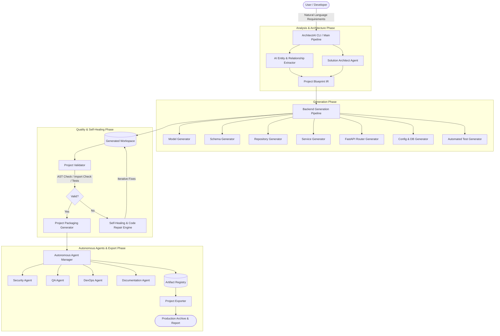

# ArchitectAI System Architecture

ArchitectAI is an autonomous, multi-agent AI tech lead platform designed to convert natural-language product requirements into validated, production-ready software systems with self-healing capabilities.

---

## 1. High-Level Architecture Overview

ArchitectAI operates as a closed-loop autonomous system where requirements are decomposed, code is generated across layered architectural boundaries, validated against strict compiler and test constraints, and automatically repaired if anomalies occur.

---

## 2. Core Architectural Components

### 2.1 Orchestration Layer
- **`ArchitectPipeline` (`orchestration/architect_pipeline.py`)**: The central pipeline coordinator orchestrating the 4 primary phases:
  1. Blueprint and code generation from natural-language specifications.
  2. Static analysis, AST validation, and test validation.
  3. Iterative self-healing and code repair when syntax or import failures occur.
  4. Packaging, multi-agent collaboration, and final export.
- **`AutonomousTechLead` (`autonomous/tech_lead.py`)**: Top-level orchestrator that schedules generation tasks across a Directed Acyclic Graph (DAG) with parallel execution capabilities.

### 2.2 Entity & Blueprint Engine
- **`AIEntityExtractor` & `RelationshipExtractor`**: Extracts entities, attributes, field types, and relational foreign-key associations from unstructured specifications.
- **`ProjectBlueprint` (`generators/entities/project_blueprint.py`)**: In-memory domain representation specifying models, schemas, and endpoints used as the single source of truth across all code generators.

### 2.3 Layered Code Generation Engine
ArchitectAI generates production-grade, clean-architecture Python backends following the Repository-Service-API pattern:
- **`ModelGenerator`**: Generates SQLAlchemy 2.0 ORM models with proper column constraints and relationships.
- **`SchemaGenerator`**: Generates Pydantic v2 schemas for request validation and response serialization.
- **`RepositoryGenerator`**: Implements transactional database access layers isolating database queries from business rules.
- **`ServiceGenerator`**: Implements domain business logic and validation.
- **`APIGenerator` & `RouterGenerator`**: Exposes dependency-injected FastAPI routers.
- **`PackagingGenerator`**: Emits `Dockerfile`, `docker-compose.yml`, `requirements.txt`, and runtime configurations.

### 2.4 Validation & Self-Healing Loop
- **`ProjectValidator`**:
  - Python AST parsing to guarantee zero syntax errors.
  - Module import resolution checks.
  - Automated test generation and test suite execution via `pytest`.
- **`SelfHealingEngine` & `CodeRepairEngine`**:
  - Automatically captures compilation or import tracebacks.
  - Analyzes error root causes.
  - Synthesizes and applies corrective code patches.
  - Re-evaluates until all quality gates pass or maximum retry limits are reached.

### 2.5 Multi-Agent Collaboration & Artifact System
- **`AgentManager`**: Manages specialized autonomous agents (Database, Backend, Security, QA, DevOps, Documentation).
- **`ArtifactRegistry`**: Collects and versions structured deliverables (ADRs, test reports, security scans, OpenAPI schemas) generated during pipeline execution.

---

## 3. Technology Stack

- **Runtime & Orchestration:** Python 3.11+, CrewAI, LangChain, Pydantic Settings.
- **LLM Integrations:** Groq (Llama-3.3-70B), Google Gemini (Gemini-2.5-Flash / Pro).
- **Generated Stack:** FastAPI, SQLAlchemy 2.0, Pydantic v2, Alembic, PostgreSQL, Redis, Docker.
- **Testing & Verification:** Pytest, AST analysis, Flake8 / Ruff.
