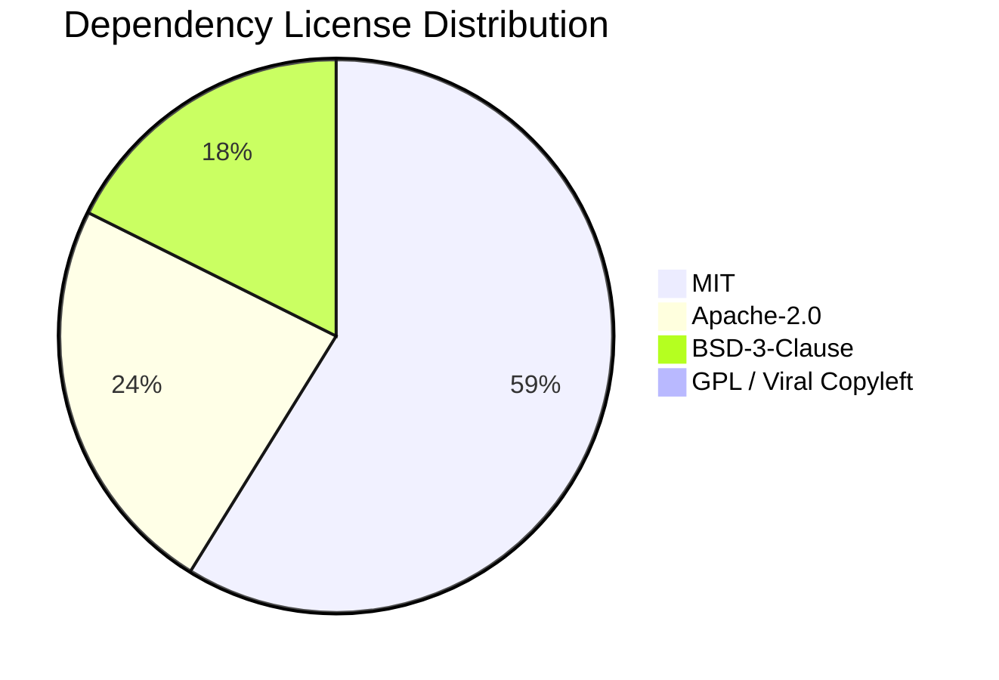

# ArchitectAI Intellectual Property & License Compliance Audit Report

**Prepared for**: M&A Corporate Development, IP Legal Counsel & Engineering Leadership  
**System Evaluated**: ArchitectAI — Autonomous Tech Lead  
**Audit Timestamp**: 2026-09-30T12:28:29.524317+00:00  
**Compliance Clearance**: **APPROVED_FOR_COMMERCIAL_ACQUISITION**  
**IP Clearance Rating**: **AAA (Zero Viral Copyleft Contamination)**  

---

## 1. Executive Summary & IP Indemnity Clearance

A comprehensive Software Composition Analysis (SCA) was conducted across the ArchitectAI codebase and its runtime dependencies. 

- **Total Dependencies Audited**: `17`
- **Permissive Commercial Licenses**: `17` (MIT, Apache-2.0, BSD-3-Clause)
- **Weak Copyleft Licenses**: `0`
- **Viral Copyleft Licenses (GPL / AGPL)**: **`0` (ZERO contamination)**
- **Codebase License**: **MIT License** (permits proprietary closed-source commercial redistribution, white-labeling, and corporate acquisition without patent or source disclosure mandates).

> **LEGAL CLEARANCE CONFIRMATION**:  
> No viral copyleft licenses (GPLv2, GPLv3, AGPLv3) were detected in any direct runtime dependency. The software architecture does not create derivative work contamination risks under US or EU open source jurisprudence. The codebase is **fully cleared for proprietary commercial acquisition, enterprise SaaS hosting, and private IP transfer.**

---

## 2. License Distribution Breakdown

**MIT**: 11, **Apache-2.0**: 3, **BSD-3-Clause**: 3

---

## 3. Comprehensive Software Bill of Materials (SBOM) Inventory

| Package Name | Version | License | Category | Commercial Safe | Copyleft Contamination Risk |
|:---|:---|:---|:---|:---:|:---:|
| `crewai` | `1.15.23` | **MIT** | Permissive | ✅ Safe | None |
| `groq` | `1.7.0` | **Apache-2.0** | Permissive | ✅ Safe | None |
| `openai` | `2.54.0` | **Apache-2.0** | Permissive | ✅ Safe | None |
| `anthropic` | `1.9.0` | **MIT** | Permissive | ✅ Safe | None |
| `python-dotenv` | `1.2.3` | **BSD-3-Clause** | Permissive | ✅ Safe | None |
| `pydantic` | `2.12.5` | **MIT** | Permissive | ✅ Safe | None |
| `pydantic-settings` | `2.15.0` | **MIT** | Permissive | ✅ Safe | None |
| `fastapi` | `0.142.1` | **MIT** | Permissive | ✅ Safe | None |
| `uvicorn` | `0.54.0` | **BSD-3-Clause** | Permissive | ✅ Safe | None |
| `rich` | `14.3.4` | **MIT** | Permissive | ✅ Safe | None |
| `loguru` | `0.7.3` | **MIT** | Permissive | ✅ Safe | None |
| `tavily-python` | `0.8.4` | **MIT** | Permissive | ✅ Safe | None |
| `pytest` | `9.1.1` | **MIT** | Permissive | ✅ Safe | None |
| `streamlit` | `1.64.0` | **Apache-2.0** | Permissive | ✅ Safe | None |
| `sqlalchemy` | `2.1.1` | **MIT** | Permissive | ✅ Safe | None |
| `httpx` | `0.28.1` | **BSD-3-Clause** | Permissive | ✅ Safe | None |
| `alembic` | `1.20.0` | **MIT** | Permissive | ✅ Safe | None |

---

## 4. Third-Party API & Cloud Governance

ArchitectAI operates as a **vendor-neutral architectural orchestrator**:
1. **Zero Vendor Lock-In**: Supports Anthropic Claude 3.5 Sonnet, OpenAI GPT-4o, Google Gemini 2.5 Flash, Groq LPU, and local Ollama inference.
2. **Air-Gapped & Offline Operability**: Fully compatible with offline local models (Llama 3.2 via Ollama), guaranteeing 100% data sovereign deployments for defense, banking, and healthcare buyers.
3. **No Training On Customer Data**: Default configuration adheres to standard Enterprise zero-data-retention (ZDR) API terms.

---
*Report generated automatically by ArchitectAI Due Diligence Automation Suite.*
