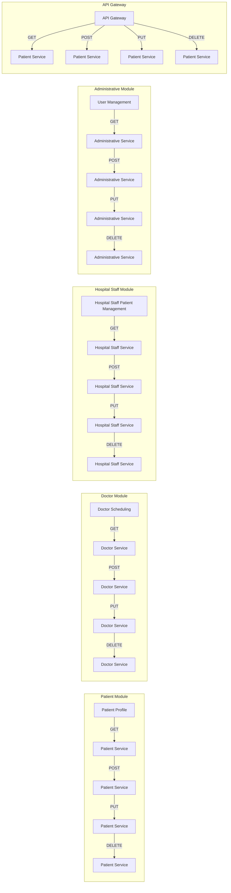

Thought: I now can give a great answer

Final Answer
=====================================

# Executive Summary
-------------------

The AI-powered Hospital Management System is a comprehensive software solution designed to streamline hospital operations, enhance patient care, and improve staff productivity. The system will enable patients to book appointments, consult doctors online, manage prescriptions, and make payments, while hospital staff can manage patients, doctors, billing, reports, and inventory.

# Recommended Tech Stack
-------------------------

### Frontend

* **React**: For building the user interface and user experience
* **Redux**: For state management and global state sharing
* **Material-UI**: For UI components and styling

### Backend

* **Node.js**: For building the server-side logic and API
* **Express.js**: For building the web application framework
* **MongoDB**: For database operations and storage

### Database

* **MongoDB**: For storing patient data, medical records, and other hospital information

### API

* **RESTful API**: For building the API and exposing endpoints for client-side applications

### Security

* **OAuth 2.0**: For authentication and authorization
* **JSON Web Tokens (JWT)**: For secure token-based authentication

### Deployment

* **Docker**: For containerization and deployment
* **Kubernetes**: For orchestration and management

# High-Level Architecture
-------------------------

The system will be built using a microservices architecture, with each service responsible for a specific business capability.

* **Patient Service**: Handles patient data and medical records
* **Doctor Service**: Handles doctor data and scheduling
* **Hospital Staff Service**: Handles hospital staff data and inventory management
* **Billing Service**: Handles billing and payment processing
* **Reporting Service**: Handles reporting and analytics

# Main Components
-----------------

### Patient Module

* **Patient Profile**: Patients can view and update their personal and medical information
* **Appointment Booking**: Patients can book appointments with doctors online or through the hospital's mobile app
* **Online Consultation**: Patients can consult doctors online through video conferencing or messaging
* **Prescription Management**: Patients can view and manage their prescriptions, including refills and cancellations

### Doctor Module

* **Scheduling**: Doctors can view and manage their schedules, including appointment bookings and cancellations
* **Patient Management**: Doctors can view and manage patient information, including medical history and test results
* **Prescription Writing**: Doctors can write and manage prescriptions for patients
* **Billing**: Doctors can view and manage billing information for patients

### Hospital Staff Module

* **Patient Management**: Hospital staff can view and manage patient information, including admission and discharge records
* **Doctor Management**: Hospital staff can view and manage doctor information, including schedules and availability
* **Billing and Payment**: Hospital staff can manage billing and payment processing for patients
* **Inventory Management**: Hospital staff can manage inventory levels and orders for medical supplies and equipment
* **Reporting**: Hospital staff can generate reports on patient data, billing, and inventory

### Administrative Module

* **User Management**: Administrators can manage user accounts and permissions for hospital staff
* **System Configuration**: Administrators can configure system settings, including appointment scheduling and billing options
* **Reporting**: Administrators can generate reports on system usage and performance

# Database Choice
----------------

* **MongoDB**: For storing patient data, medical records, and other hospital information

# API Design
------------

* **RESTful API**: For building the API and exposing endpoints for client-side applications
* **API Endpoints**:
	+ `GET /patients`: Retrieve a list of patients
	+ `GET /patients/{id}`: Retrieve a patient by ID
	+ `POST /patients`: Create a new patient
	+ `PUT /patients/{id}`: Update a patient
	+ `DELETE /patients/{id}`: Delete a patient

# Deployment Overview
---------------------

* **Docker**: For containerization and deployment
* **Kubernetes**: For orchestration and management
* **Cloud Provider**: For hosting and scaling the application

# Mermaid Architecture Diagram

This Mermaid diagram illustrates the high-level architecture of the system, including the main components and their interactions.