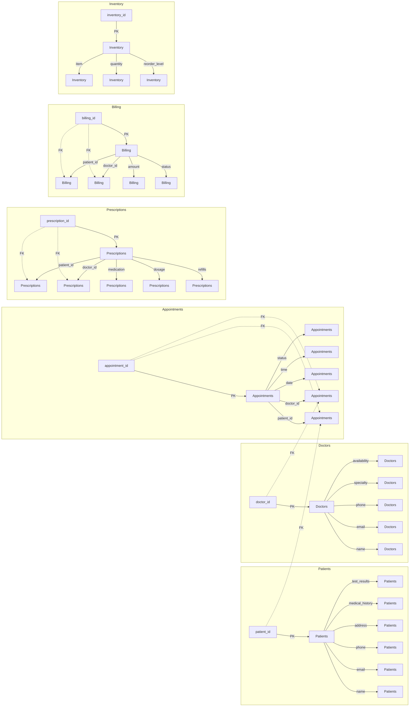

Thought: I now can give a great answer

Final Answer
=====================================

# Database Design
----------------

## Database Technology
---------------------

* **MongoDB**: For storing patient data, medical records, and other hospital information

## Tables
---------

### Patients Table

* **patient_id** (Primary Key): Unique identifier for each patient
* **name**: Patient's name
* **email**: Patient's email address
* **phone**: Patient's phone number
* **address**: Patient's address
* **medical_history**: Patient's medical history
* **test_results**: Patient's test results

### Doctors Table

* **doctor_id** (Primary Key): Unique identifier for each doctor
* **name**: Doctor's name
* **email**: Doctor's email address
* **phone**: Doctor's phone number
* **specialty**: Doctor's specialty
* **availability**: Doctor's availability

### Appointments Table

* **appointment_id** (Primary Key): Unique identifier for each appointment
* **patient_id** (Foreign Key): Reference to the Patients table
* **doctor_id** (Foreign Key): Reference to the Doctors table
* **date**: Appointment date
* **time**: Appointment time
* **status**: Appointment status

### Prescriptions Table

* **prescription_id** (Primary Key): Unique identifier for each prescription
* **patient_id** (Foreign Key): Reference to the Patients table
* **doctor_id** (Foreign Key): Reference to the Doctors table
* **medication**: Prescription medication
* **dosage**: Prescription dosage
* **refills**: Prescription refills

### Billing Table

* **billing_id** (Primary Key): Unique identifier for each billing
* **patient_id** (Foreign Key): Reference to the Patients table
* **doctor_id** (Foreign Key): Reference to the Doctors table
* **amount**: Billing amount
* **status**: Billing status

### Inventory Table

* **inventory_id** (Primary Key): Unique identifier for each inventory item
* **item**: Inventory item
* **quantity**: Inventory quantity
* **reorder_level**: Inventory reorder level

## Relationships
--------------

* A patient has many appointments (one-to-many).
* A doctor has many appointments (one-to-many).
* An appointment belongs to one patient (many-to-one).
* An appointment belongs to one doctor (many-to-one).
* A prescription belongs to one patient (many-to-one).
* A prescription belongs to one doctor (many-to-one).
* A billing belongs to one patient (many-to-one).
* A billing belongs to one doctor (many-to-one).

## Primary Keys
--------------

* **patient_id** in the Patients table
* **doctor_id** in the Doctors table
* **appointment_id** in the Appointments table
* **prescription_id** in the Prescriptions table
* **billing_id** in the Billing table
* **inventory_id** in the Inventory table

## Foreign Keys
--------------

* **patient_id** in the Appointments table references the Patients table
* **doctor_id** in the Appointments table references the Doctors table
* **patient_id** in the Prescriptions table references the Patients table
* **doctor_id** in the Prescriptions table references the Doctors table
* **patient_id** in the Billing table references the Patients table
* **doctor_id** in the Billing table references the Doctors table

## Indexes
---------

* **patient_id** index on the Patients table
* **doctor_id** index on the Doctors table
* **appointment_id** index on the Appointments table
* **prescription_id** index on the Prescriptions table
* **billing_id** index on the Billing table
* **inventory_id** index on the Inventory table

## Mermaid ER Diagram
