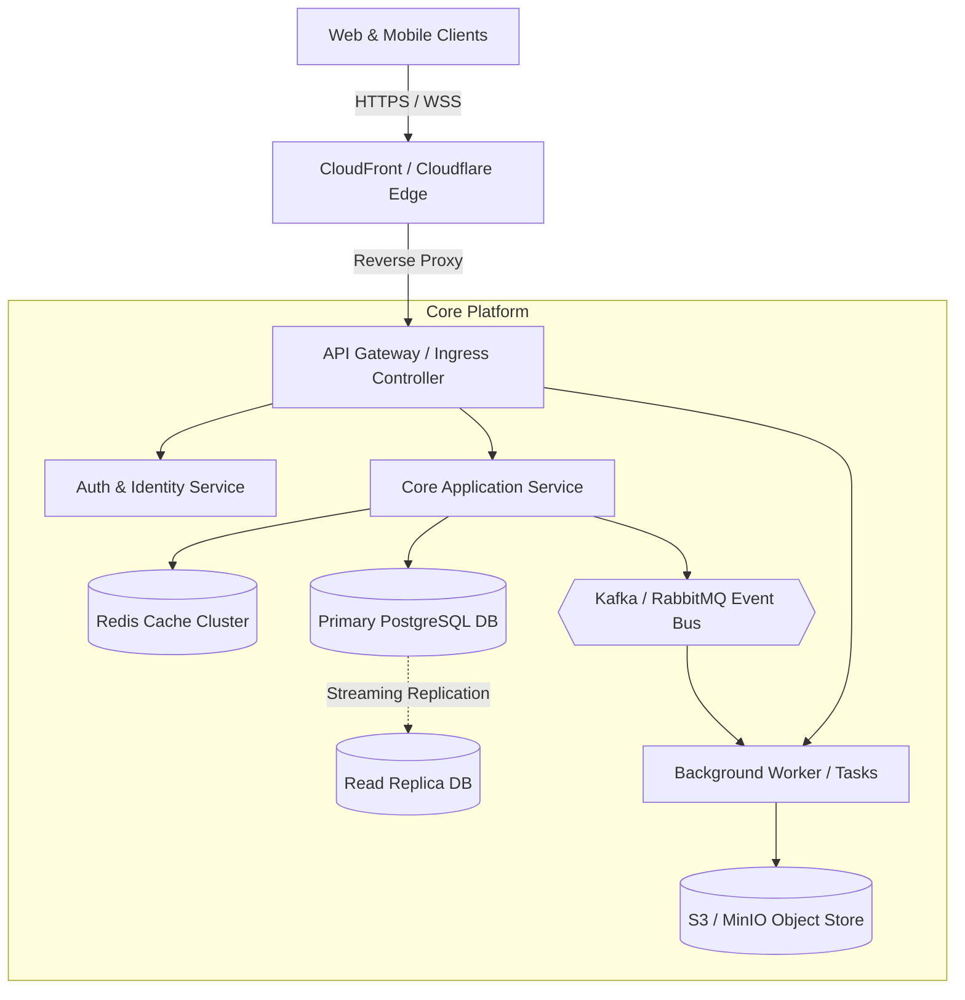
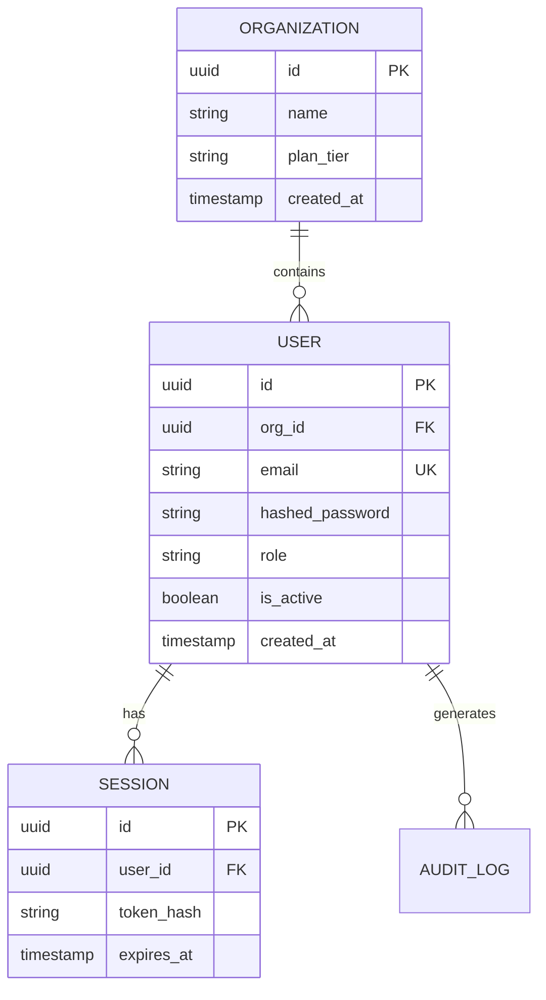

# Software Architecture Document (SAD)
> **Project Name:** {{PROJECT_NAME}}  
> **Author / Architect:** {{ARCHITECT_NAME_OR_AGENT}}  
> **Date:** {{DATE}}  
> **Status:** [Draft | Under Review | Approved]  
> **Version:** 1.0.0  

---

## 1. Executive Summary & Problem Framing

### 1.1 Business Context & Problem Statement
*Describe the high-level business problem this system solves and why it is critical.*

### 1.2 Target Audience & Stakeholders
*Identify primary users, client types (web, mobile, third-party integrations), and internal stakeholders.*

### 1.3 Scope Boundaries
- **In Scope:**
  - Capability 1
  - Capability 2
- **Out of Scope (Deferred/Excluded):**
  - Excluded capability 1

### 1.4 Key Assumptions & Constraints
- Assumption 1: ...
- Constraint 1 (e.g., Cloud provider, budget, regulatory): ...

---

## 2. Functional Requirements & Core User Journeys

### 2.1 Domain Capabilities
| Domain / Module | Capability Description | Primary Actors |
| :--- | :--- | :--- |
| Core Service | ... | End User |
| Billing & Payments | ... | Customer / Finance |
| Admin / Operations | ... | Internal Operators |

### 2.2 Critical User Journeys
1. **Journey 1 (e.g., Order Checkout):**
   - Step 1: User initiates ...
   - Step 2: System validates ...
   - Step 3: Event published to ...

---

## 3. Non-Functional Requirements (NFRs) & SLOs

| Category | Target Metric | Measurement Strategy / SLO |
| :--- | :--- | :--- |
| **Availability** | 99.9% uptime (~8.7h downtime/year) | Multi-AZ deployment, health check probes |
| **Latency** | p95 < 250ms, p99 < 500ms | APM tracing, CDN edge caching |
| **Throughput** | {{PEAK_RPS}} requests/sec peak | Horizontal Pod Autoscaling (HPA) |
| **Scalability** | 10x traffic growth in 12 months | Stateless microservices, read replicas |
| **Data Consistency**| Strong consistency for financials; Eventual for feeds | ACID RDBMS + Redis pub/sub |
| **Security** | Zero-trust, RBAC, OAuth2/JWT | OWASP Top 10 compliance, encryption at rest/transit |
| **Observability** | 100% structured JSON logs, distributed traces | OpenTelemetry + Prometheus + Grafana |

---

## 4. Scale and Capacity Estimations

### 4.1 Traffic Profile
- **Daily Active Users (DAU):** {{DAU}}
- **Daily Total Requests:** `{{DAU}} * {{AVG_ACTIONS_PER_USER}} = {{TOTAL_DAILY_REQUESTS}}`
- **Average QPS:** `{{TOTAL_DAILY_REQUESTS}} / 86,400 = {{AVG_QPS}}`
- **Peak QPS (Peak Factor: 3x):** `{{AVG_QPS}} * 3 = {{PEAK_QPS}}`
- **Read / Write Ratio:** e.g., 80:20 (Read-heavy)

### 4.2 Storage & Bandwidth Projections
- **Average Payload Size:** {{PAYLOAD_SIZE_KB}} KB
- **Daily Storage Ingestion:** `{{TOTAL_DAILY_WRITES}} * {{AVG_RECORD_SIZE_KB}} KB = {{DAILY_GB}} GB/day`
- **1-Year Storage Need:** `{{DAILY_GB}} * 365 = {{YEARLY_STORAGE_TB}} TB` (with 20% replication buffer)
- **Peak Ingress/Egress Bandwidth:** `{{PEAK_QPS}} * {{PAYLOAD_SIZE_KB}} KB = {{MB_PER_SEC}} MB/s`

---

## 5. High-Level Architecture

### 5.1 Architecture Pattern
*Explain architectural style (e.g., Modular Monolith, Event-Driven Microservices, CQRS).*

### 5.2 System Context & Component Diagram

### 5.3 Service & Component Breakdown
| Component | Primary Responsibility | Tech Stack | Communication |
| :--- | :--- | :--- | :--- |
| **API Gateway** | Routing, Rate Limiting, SSL Termination | Envoy / NGINX | HTTPS / gRPC |
| **Core Service** | Business Logic, CRUD, Domain Rules | Python FastAPI | Synchronous REST |
| **Worker Engine** | Asynchronous jobs, report generation | Celery / Arq | AMQP / Redis |
| **Cache Layer** | Session caching, query acceleration | Redis | In-memory TCP |
| **Primary Storage**| Relational transactional data | PostgreSQL 16 | ACID SQL |

---

## 6. Data Modeling & Storage Strategy

### 6.1 Storage Strategy by Domain
- **Relational / Transactional Data:** PostgreSQL (ACID compliance, foreign keys, row indexing).
- **Ephemeral / Caching:** Redis (TTL-based session tokens, rate limits, hot query cache).
- **Blob / Unstructured:** S3 / MinIO (user uploads, exported reports, media).
- **Search & Analytics:** OpenSearch / Elastic (full-text search, audit logs).

### 6.2 Core Entity-Relationship Diagram (ERD)

### 6.3 Partitioning, Indexing & Retention
- **Indexing Strategy:** B-tree indexes on foreign keys (`user_id`, `org_id`) and lookup fields (`email`).
- **Retention & Archival:** Hot data kept in primary DB for 90 days; cold data partitioned to S3 parquet.

---

## 7. API Design & Contracts

### 7.1 Protocol & Conventions
- **Format:** RESTful JSON over HTTPS (TLS 1.3).
- **Status Codes:** Standard HTTP codes (200 OK, 201 Created, 400 Bad Request, 401 Unauthorized, 403 Forbidden, 404 Not Found, 429 Too Many Requests, 500 Internal Error).
- **Idempotency:** `Idempotency-Key` header enforced on critical `POST` mutations.

### 7.2 Primary API Endpoints
| Method | Endpoint | Description | Auth Required | Rate Limit |
| :--- | :--- | :--- | :--- | :--- |
| `POST` | `/api/v1/auth/login` | Authenticate & retrieve JWT tokens | No | 10 req/min |
| `GET` | `/api/v1/resources` | List resources (paginated: cursor) | Bearer JWT | 100 req/min |
| `POST` | `/api/v1/resources` | Create a new resource | Bearer JWT | 30 req/min |
| `GET` | `/api/v1/resources/{id}`| Fetch specific resource details | Bearer JWT | 100 req/min |

---

## 8. Reliability, Fault Tolerance & Resilience

### 8.1 Circuit Breakers & Fallbacks
- Integrations with external APIs wrap requests in circuit breakers (e.g., open circuit after 5 consecutive failures within 10s).
- Fallback responses provided where degraded operation is acceptable.

### 8.2 Retries with Exponential Backoff & Full Jitter
- Formula: `sleep = rand(0, min(cap, base * 2 ^ attempt))`
- Idempotent GET and PUT requests retry up to 3 times; non-idempotent mutations require idempotency keys.

### 8.3 Rate Limiting & Overload Protection
- Token bucket algorithm implemented at API Gateway and Redis level.
- Priority queueing sheds background traffic during peak spikes.

---

## 9. Security, Identity & Compliance Architecture

### 9.1 Authentication & Authorization
- **AuthN:** OAuth2 with JWT access tokens (15-min expiry) and secure HTTP-only refresh tokens.
- **AuthZ:** Role-Based Access Control (RBAC) enforced via declarative route dependencies.

### 9.2 Data Protection & Encryption
- **In Transit:** TLS 1.3 required on all ingress and internal service mesh traffic.
- **At Rest:** AES-256 encryption on database volumes and object storage buckets.
- **Secrets Management:** Secrets injected via environment variables managed by Vault / AWS Secrets Manager.

---

## 10. Observability & Operations

### 10.1 Structured Telemetry
- **Logs:** Structured JSON emitted to `stdout` containing `timestamp`, `level`, `trace_id`, `span_id`, and `message`.
- **Metrics:** Prometheus scrape endpoint (`/metrics`) monitoring request duration, error rates, DB pool saturation.
- **Tracing:** OpenTelemetry distributed tracing injected across all gateway and service boundaries.

### 10.2 Alerts & Health Monitoring
- Liveness probe (`/healthz/live`): Responds 200 if process is running.
- Readiness probe (`/healthz/ready`): Validates database and Redis connectivity.
- P1 Alert: Error rate > 2% for 3 consecutive minutes or p95 latency > 1000ms.

---

## 11. Architectural Decision Records (ADRs) & Trade-Offs

### 11.1 Key Trade-Offs
| Decision / Alternative | Pros | Cons / Trade-offs | Selected? |
| :--- | :--- | :--- | :--- |
| **PostgreSQL vs MongoDB** | Strong ACID, mature tooling, relational integrity | Horizontal sharding is more complex than NoSQL | **Yes** (Data integrity priority) |
| **Sync REST vs Event Stream** | Simpler debugging and request tracing | Tight coupling if used across many downstream services | **Hybrid** (Sync for UX, Kafka for async) |
| **Redis Cache vs In-Process Cache** | Shared across replicas, persists across restarts | Network hop latency (~1-2ms) | **Yes** (Stateless pod requirement) |

### 11.2 Decision Log (ADR Summary)
- **ADR-001:** Adopted modular architecture with repository and service layer pattern to allow independent unit testing.
- **ADR-002:** Enforced cursor-based pagination for high-volume list queries to prevent SQL deep-offset performance cliffs.

---

## 12. Verification & Next Steps
- [ ] Requirements traceability matrix reviewed
- [ ] Threat model and security review completed
- [ ] Database migration and seed plan confirmed
- [ ] Load testing benchmark suite defined
